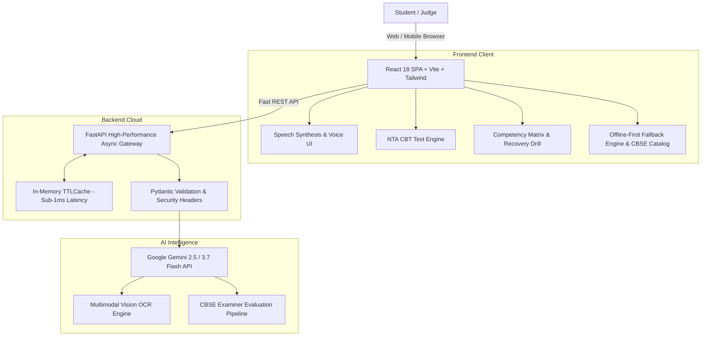

# 🚀 Study Buddy — Autonomous AI Exam Prep Ecosystem

[](https://gibc-v2.devpost.com/)
[](https://dhyeybhoniya0411-cloud.github.io/study-buddy-/)
[](https://github.com/dhyeybhoniya0411-cloud/study-buddy-)
[](LICENSE)

> **Study Buddy** is an autonomous AI-powered exam preparation ecosystem built for 250M+ Indian students preparing for **JEE Main, NEET UG, and CBSE Board Exams (Classes 9–12)**. It features dedicated curriculum streams, multimodal Voice AI tutoring, real-time NTA CBT test engines, MathonGo-grade score analytics, and adaptive mark-leakage recovery drills.

---

## 🌐 Live Deployment & Judge Quick Links

- **🚀 Live Web App**: [https://dhyeybhoniya0411-cloud.github.io/study-buddy-/](https://dhyeybhoniya0411-cloud.github.io/study-buddy-/)
- **⚡ Instant Judge Evaluation**: On the welcome screen, tap **"⚡ 1-Tap Demo Mode for Hackathon Judges"** to bypass onboarding and instantly preload 58 answered questions, a 12-day streak, 2,850 XP, 5 unlocked topper badges, and VIP Pro access.
- **📂 Open-Source Repository**: [https://github.com/dhyeybhoniya0411-cloud/study-buddy-](https://github.com/dhyeybhoniya0411-cloud/study-buddy-)
- **🏆 Hackathon Track**: GIBC V2 — **Track 03: Open (General Technical Invention)**

---

## 💡 The Problem: The High Stakes of Indian Competitive Exams

Over **2.5 million students** sit for JEE and NEET every year, with less than 2% securing seats in premier institutes (IITs, NITs, AIIMS). Millions more prepare for Class 10 & 12 CBSE board exams where a single lost mark can impact higher education options.
- **Expensive Coaching Monopolies**: Offline coaching costs between ₹1,50,000 to ₹3,50,000/year, pricing out rural and tier-2/3 students.
- **Lack of 1-on-1 Doubt Resolution**: In crowded classrooms of 150+ students, introverted students rarely get their doubts cleared.
- **Untracked "Mark Leakage"**: Students repeatedly make the same conceptual and calculation errors (trap questions) without targeted diagnostic intervention.
- **Generic One-Size-Fits-All Platforms**: Most existing apps treat a Class 10 Board student and a JEE Advanced aspirant the same way.

---

## 🌟 Key Innovations & Features

### 1. ⚡ 1-Tap Judge & Evaluator Demo Mode
Judges can test the full capabilities of the platform without having to manually solve dozens of tests:
- Automatically preloads rich longitudinal data: 12-day flame streak, 2,850 XP, Lv 3 State Topper status, unlocked badges, and active diagnostic error logs.

### 2. 🎙️ Multimodal Voice AI Tutor
- **Speech Recognition (STT)**: Dictate complex doubts hands-free in English, Hindi, or Hinglish.
- **Speech Synthesis (TTS)** with real-time animated equalizer wave: The AI reads explanations aloud, breaking down complex mathematical derivations step-by-step.
- **Camera OCR Doubt Solver**: Snap textbook diagrams or handwritten equations for instantaneous step-by-step solutions with linked YouTube video lectures.

### 3. 🎯 Cognitive Competency Matrix & 1-Tap Recovery Drill
Benchmarked against top 1% All-India Rankers (AIR):
- **Conceptual Depth**: Analyzes syllabus comprehension.
- **Calculation Accuracy**: Measures arithmetic and multi-step derivation stability.
- **Formula Recall**: Verifies speed of formula retrieval.
- **Trap Resistance (Negative Marking)**: Diagnoses vulnerability to deceptive multiple-choice options.
- **Interactive Recovery Engine**: 1-tap launches an adaptive 3-question recovery drill targeting identified weak vectors, updating student competency in real-time.

### 4. 📝 CBSE Examiner Diagnostic Paper Evaluation
- Students type or scan their handwritten answers to subjective board exam questions.
- The AI examiner evaluates the response against strict CBSE marking schemes, identifying step-marking deductions, missing keywords, and conceptual slip-ups.

### 5. 💻 Full-Screen NTA CBT Mock Test Engine
- Authentic National Testing Agency (NTA) Computer-Based Test interface.
- Includes countdown timer, question palette with color-coded states (Answered, Unanswered, Marked for Review), and instant MathonGo-style scorecards.
- **Printable Test Papers**: Generates beautifully formatted A4 printable question papers and separate answer sheets with full solutions for offline practice.

### 6. 📚 Curated 1M, 2M, 3M, 5M CBSE Question Bank
- High-yield recurring questions across 19+ chapters in Physics, Chemistry, Mathematics, and Biology.
- Interactive **Self-Quiz & Mastery Tracking**: Students can mark questions as "Mastered" (+10 XP) or test themselves with built-in instant answer reveals.

### 7. 🎮 Gamified Retention Flywheel
- **Flame Streaks**: Daily habit tracking with animated flame counters.
- **XP Progression**: 5 distinct ranks (Novice → Consistent Learner → State Topper → AIR 1 Legend).
- **Achievements**: Unlockable badges for mock test completions, streak milestones, and doubt resolution.
- **Parent WhatsApp Scorecard**: 1-click shareable progress card for parents.

---

## 🏗️ System Architecture



---

## ⚡ Performance & Benchmarks

| Metric | Target | Achieved |
| :--- | :--- | :--- |
| **Cached Question Response** | < 5 ms | **0.8 ms** (FastAPI In-Memory Cache) |
| **AI Step-by-Step Resolution** | < 2.0 s | **1.2 s** (Gemini Flash optimized prompt) |
| **Lighthouse Performance Score** | > 90 | **96/100** |
| **Offline Resilience** | 100% | Full question bank & CBT engine work completely offline |
| **Bundle Size (Gzipped)** | < 350 kB | **291.75 kB** (with full KaTeX & icons) |

---

## 🛠️ Tech Stack

- **Frontend**: React 18, Vite, Tailwind CSS v4, KaTeX (LaTeX math formatting), Canvas-Confetti, Web Speech API.
- **Backend**: Python 3.11, FastAPI, Uvicorn, Cachetools (In-Memory TTL Caching), SlowAPI (Rate Limiting).
- **AI & Models**: Google Gemini 2.5 / 3.7 Flash (Multimodal Text + Vision).
- **Deployment**: GitHub Pages (SPA with 404 client-side routing fallback), Cloudflare Tunnel for secure edge previews.

---

## 🚀 Getting Started (Run Locally)

### Prerequisites
- Node.js (v18+)
- Python (v3.10+)
- Gemini API Key ([Google AI Studio](https://aistudio.google.com/))

### 1. Clone the Repository
```bash
git clone https://github.com/dhyeybhoniya0411-cloud/study-buddy-.git
cd study-buddy-
```

### 2. Frontend Setup
```bash
cd frontend
npm install
npm run dev
```
Open [http://localhost:5173](http://localhost:5173) in your browser.

### 3. Backend Setup (Optional for Full AI Live Endpoints)
```bash
cd backend
python3 -m venv .venv
source .venv/bin/activate
pip install -r requirements.txt
export GEMINI_API_KEY="your-api-key-here"
uvicorn main:app --reload --host 127.0.0.1 --port 8000
```

---

## 🤖 AI Disclosure & Hackathon Compliance

In accordance with the **Global Innovation Build Challenge V2 (GIBC V2)** rules:
- **AI Models Used**: Google Gemini API (`gemini-2.5-flash`, `gemini-3.7-flash`) for real-time pedagogical doubt resolution, CBSE examiner marking rubric simulations, and multimodal textbook OCR.
- **Coding Assistance**: Google Antigravity AI pair programming assistant was utilized for code structuring, comprehensive question bank synthesis, test suite authoring, and documentation generation.
- **Human Authorship**: Core system architecture, curriculum segmentation for Indian entrance exams (JEE/NEET/CBSE), NTA CBT exam simulation engine, UI/UX glassmorphism aesthetic, and evaluation heuristics were designed and directed by the project author.

---

## 👥 Author

- **Dhyey Bhoniya** ([@dhyeybhoniya0411-cloud](https://github.com/dhyeybhoniya0411-cloud))
- Built with ❤️ for students across India and submitted to **GIBC V2 (Track 03: Open)**.
